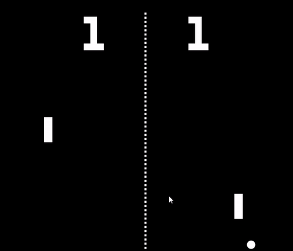
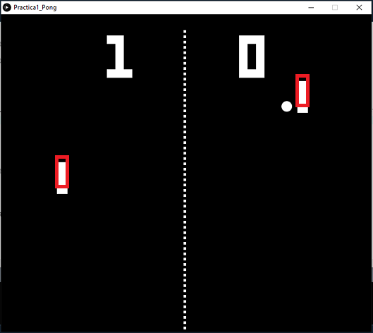
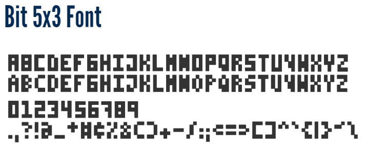

# CIU - Práctica 1
## Programando Pong con Processing - Ismael Aarab Umpiérrez

El ejercicio a realizar en **Creando Interfaces de Usuario** es programar uno de los juegos más conocidos de la industria de los videojuegos. "**Pong**" es un juego sencillo de ping pong donde hay dos jugadores, una pelota y un marcador para saber la puntuación.
Este juego se programará con **Processing**, un proyecto de código abierto basado en el lenguaje Java, que retiene como objetivo facilitar cualquier desarrollo con fines creativos. 



## Desarrollo
Para el comienzo de la práctica, se debe partir de lo básico:
### 1. Crear la pelota
- Una elipse de un tamaño en concreto donde se moverá por la pantalla. Se creará la figura para que aparezca por la pantalla:
```int px, py;  //coordenada de pelota
px=width/2-2;    //Ubicación de la pelota (centro de la pantalla)
py=height/2;
ellipse(px, py, 20, 20); //(coordenada x, coordenada y, ancho, alto)
```

- La pelota también tendrá una velocidad para que se pueda desplazar, con un número aleatorio del 0 al 10, saldrá hacia la derecha o hacia la izquierda de la pantalla al comienzo del juego:

```int vx, vy;  //velocidad de la pelota
 if((int) random(0,10) %2 ==0){
  vx=5;
 } else {
  vx=-5;
 }
 
 px=px+vx;  //Movemos la posición de la pelota con la velocidad que le asignamos
 py=py+vy;
```

### 2. El rebote y la salida de la pelota
- Cuando una pelota choca contra la pared, este no debe de irse más allá de la pantalla, con lo cual, hay que crearle un límite de movimiento, y en el caso que llegue a ese limite, hacerle un efecto de rebote y que se vaya al otro extremo de la pantalla:
```
if (py>height || py < 0) {
      vy=-vy;
    }
    
if (px>width || px < 0) {
      vx=-vx;
    }
```

- La pelota también debe salir desde el centro hacia cualquier lado. Para ello, se ha generado con un random, a que posición irá la pelota (a la izquierda o derecha, recto o diagonal, etc.). Estas son las condiciones:

```
  void pelotaAleatoria(){ 
    if((int) random(0,10) %2 ==0){
      vx=5;  //Sale hacia la derecha
    } else {
      vx=-5;  //Sale hacia la izquierda
    }
    
    vy=(int) random(-5,5);  //Sale diagonalmente arriba o abajo, o recto
  }

```

### 3. Crear a los jugadores
- Los jugadores serán dos rectángulos que se ubicarán por cada lado de la pantalla, estos como la pelota, tendrán un ancho y un alto.
- También cada jugador debe de mover a su figura, uno lo moverá con un ratón, y el otro con el teclado (solo se podrán mover verticalmente).
- Los jugadores también tienen una velocidad en concreto:
  - El que manejará el raton tendrá su propia velocidad debido a que depende que tan rápido mueva el ratón el usuario.
  - El usuario del teclado cada vez que pulse una tecla, este subirá o bajará a una velocidad constante.

```int jx_der,jx_izq, jy;  //coordenada rectangulo
int ancho = 20;
int alto = 60;
jx_der=(int) (width*0.8);   //Posiciones de los jugadores
jx_izq = (int) (width*0.15);
jy = (height/2)-20;   //Altura del jugador

//Creando figuras
rect(jx_der, mouseY,ancho,alto);  //"mouseY" es la posición del ratón del jugador que juegue con este.
rect(jx_izq,jy,ancho,alto)

if(keyPressed){       //Teclas de movimiento para el usuario de teclado
      
      if(key=='s'){
       jy=jy+10; 
      } else if(key=='w'){
       jy=jy-10;
      }
}
```

### 4. Crear detección de colisiones

Ya que el objetivo es que los rectángulos que creamos choquen con la pelota y hagan rebotar, estos deberian de tener una caja de colisión (**Hitbox**) para que pueda producir el efecto de rebote. Para poder realizarlo se ha de tener en cuenta:
- Posición horizontal de los extremos de la pelota con la posición horizontal de los extremos del jugador.
- Posición vertical de los extremos de la pelota con la posición vertical de los extremos del jugador.

Una vez detectado la colisión, se ejecutará el rebote, dirigiendose al campo contrario, pero con la velocidad verical aleatoria para que no se dirija siempre al mismo sitio.
> Nota: los "+20" que se ven sueltos es el ancho y el alto de la pelota.
```
if ((vx>0 && px+20=>jx_der && jx_der+ancho > px && mouseY <= py+20 && mouseY+alto > py )){  //Jugador derecho
            vx=-vx;
            vy= (int) random(-5,5);
}

if ((vx<0 && px+20 >=jx_izq && jx_izq+ancho > px && jy <= py+20 && jy+alto > py )){  //Jugador izquierdo
            vx=-vx;
            vy= (int) random(-5,5);
}
```

La caja de colisión no siempre quedará perfecta, pero sí a un resultado aproximado. Tras varias pruebas realizadas, la caja de colisión se vería así:
- 


Tras hacer estas condiciones, se pueden quitar las otras de rebote en los laterales para poder realizar el siguiente paso:
```
 ̶i̶f̶ ̶(̶p̶x̶>̶w̶i̶d̶t̶h̶ ̶|̶|̶ ̶p̶x̶ ̶<̶ ̶0̶)̶ ̶{̶
̶ ̶ ̶ ̶ ̶ ̶ ̶v̶x̶=̶-̶v̶x̶;̶
̶ ̶ ̶ ̶ ̶}̶
```
> Las condiciones de los rebotes en los lados verticales se siguen manteniendo ya que sigue realizando su función.

### 5. Implementar marcador
Ya quitado las condiciones de rebote en los extremos laterales y haberle puesto una caja de colisión, ahora se puede implementar un marcador donde indica la puntuación de cada jugador, referenciando a quién va llevando la ventaja en la partida.
- Una vez que la pelota pase a uno de los jugadores, habrá una variable que hará que incremente la puntuación tanto del jugador derecho, como el del jugador izquierdo.

```
int golesDerecha=0;
int golesIzquierda=0;

if (px>width) {
      golesIzquierda=golesIzquierda+1;
} else if (px<0){
      golesDerecha=golesDerecha+1;
}

```
Ahora se mostrará la puntuación actual por la pantalla:

```text(golesDerecha, width/2+100, 120);
text(golesIzquierda, width/2-150, 120);
```

Para hacer el texto lo más parecido posible al estilo de ***Pong*** se ha descargado una fuente de Internet, "**Bit 5x3 font**".
Le adjunto la página web de donde se descargó la fuente de texto [aquí](https://www.mattlag.com/bitfonts/).


  ```PFont f;
  f = createFont("bit5x3.ttf", 128);
  textFont(f);
  ```
  
  - 
  
### 6. Sonido
Como último punto de implementación básica, se incluirá en el programa un efecto de sonido, en el cual, si la pelota rebota, se lanzará ese efecto indicando que la pelota lo ha realizado correctamente.
- La biblioteca a utilizar para implementar el efecto de sonido es **Minim**. Esta nos permite importar archivos ".mp3" para los efectos de sonido, no solo es para los efectos, también puedes implementar música de fondo, en el cual, ayuda bastante.

```
import ddf.minim.*;

void setup() {
 Minim soundengine;
 AudioSample sonido1;
 soundengine = new Minim(this);

 sonido3 = soundengine.loadSample("rebote.mp3", 1024);
 .
 .
 .
 if ((vx>0 && px+20>=jx_der && jx_der+ancho > px && mouseY <= py+20 && mouseY+alto > py )){  //Colision Rectangulo (linea) con circulo (pelota)
             vx=-vx;
             vy= (int) random(-5,5);
             sonido3.trigger();
 }
}
```

### 7. Implementaciones adicionales
- Incluir el campo central
  - Para hacerlo lo más parecido posible al **Pong** original, se ha dibujado líneas en el centro de la pantalla. Para realizarlo, se hizo una declaración **for** para dibujar las lineas en cada posicion diferente del centro.
        
        int posicion_linea_x;
        int posicion_linea_y;
        
        posicion_linea_x = width/2-5;
        posicion_linea_y = height/20;
        
        for(int i = 0; i<80; i++){
          rect(posicion_linea_x, posicion_linea_y,5,5);
          posicion_linea_y +=10;
        }

- Iniciar la partida manualmente
  - Para que la pelota no salga automáticamente después de cada punto y el jugador se confunda o se pierda, se ha hecho que cuando se pulse una tecla (en este caso, la tecla del espacio) se active un flag donde indica que la patida puede comenzar , así los jugadores pueden empezarlo cuando quieran.
          
          int flagStarted;
          flagStarted=0;
          .
          .
          .
          if(keyPressed){
           if(key==' '){
             flagStarted=1;
           }
          }
          
          if( flagStarted==1){
          .
          .
          .
          }
          
- Música de fondo
  - Aprovechando que tenemos implementada la biblioteca **Minim** introduciremos una música de fondo para que el juego esté más animado. Se ha puesto una música de introducción antes que de empiece la partida, y otra tras empezar la partida. Ambas músicas son del juego "**Mike Tyson Punch-out**" de la consola **NES**. [Introducción](https://www.youtube.com/watch?v=oh98_8iUV9I) y [Durante la partida](https://www.youtube.com/watch?v=VE8vKLEK6A8).
  
          sonido1 = soundengine.loadSample("intro.mp3", 1024);
          sonido1.trigger();
          sonido2 = soundengine.loadSample("background.mp3", 1024);
          .
          .
          .
          if( flagStarted==1){
          sonido1.stop();
          sonido2.trigger();
          }
- Incrementar la velocidad
  - Para que el juego no sea constante y a la larga sea aburrido, se ha creado un contador en el cual, por cada "x" rebotes totales que los jugadores han hecho, se incrementa 1 unidad de velocidad, para así hacerlo más díficil y divertido.
          
          int cuentaRebote=0;
          .
          .
          .
          if ((vx<0 && px+20 >=jx_izq && jx_izq+ancho > px && jy <= py+20 && jy+alto > py )){  //Jugador izquierdo
            vx=-vx;
            vy= (int) random(-5,5);
            cuentaRebote++;
          }
          
          if(cuentaRebote >6){
            if(vx<0){
              vx = vx-1;
            } else {
              vx = vx+1;
            }
            cuentaRebote=0;
           }
          
